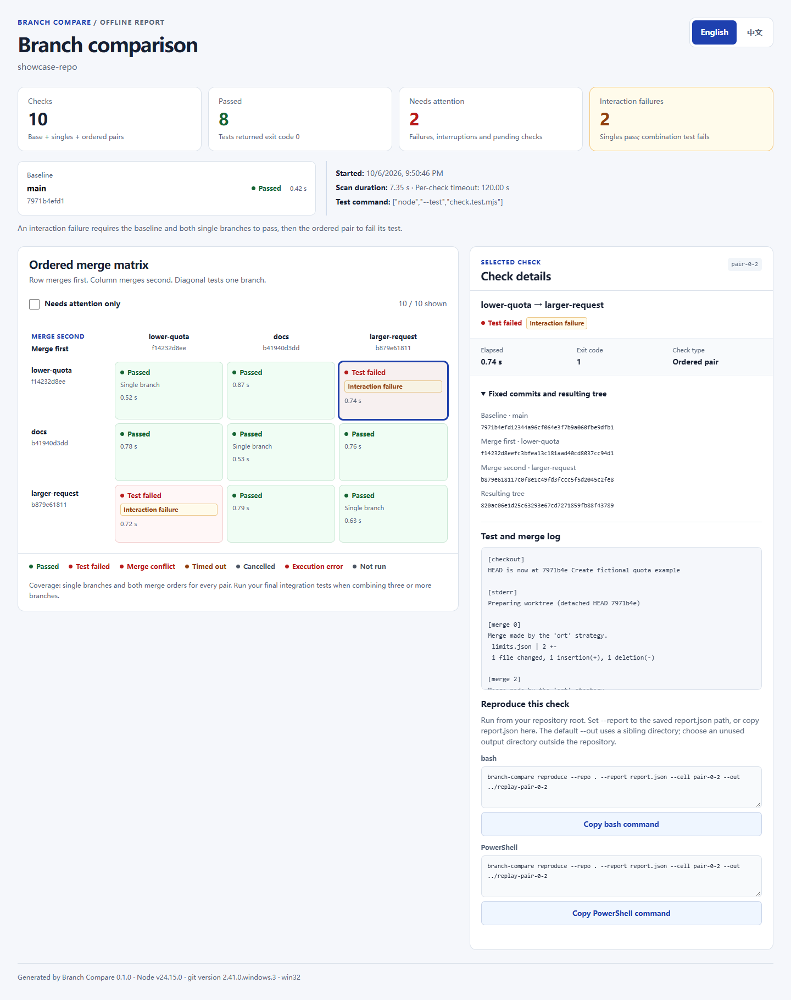

# Branch Compare

Find Git branches that pass their tests alone and fail when combined. Branch Compare runs a baseline, each candidate branch, and every ordered pair in disposable worktrees, then produces an offline English/Chinese comparison report.

[English](README.md) · [简体中文](README_ZH.md) · [Quick start](#quick-start) · [Scan your branches](#scan-your-branches) · [Reproduce](#reproduce-a-result)



## Quick start

Requires **Node.js 24 or later** and **Git** (tested with Git 2.41). The CLI has no runtime npm dependencies.

```sh
git clone https://github.com/cloudwallker/branch-compare.git
cd branch-compare
npm ci
npm run build
```

Create a fictional repository with three branches and run its tests:

```sh
node examples/create-demo.mjs ./demo-repo
node dist/cli.js run --repo ./demo-repo --base main --ref lower-quota --ref docs --ref larger-request --out ./demo-report -- node --test check.test.mjs
```

Open `demo-report/report.html` in a browser. The report contains **10 checks**, with **2 interaction failures**: merging `lower-quota` and `larger-request` fails in both orders. Each branch passes alone; the combined request of 50 exceeds the quota of 20. The scan exits with **1**, as expected for this demo.

`demo-repo`, `demo-report`, and the replay directory below must be new directories. Here the report is outside the scanned `demo-repo` Git repository.

## Scan your branches

From the Branch Compare checkout:

```sh
node dist/cli.js run --repo ../my-project --base main --ref feature-a --ref feature-b --out ../branch-report -- node --test
```

Arguments after `--` launch a program directly, with each argument passed literally. Use `--test` for a shell command, including installation followed by tests:

```sh
node dist/cli.js run --repo ../my-project --base main --ref feature-a --ref feature-b --out ../branch-report --test 'npm ci && npm test'
```

This shell form also supports Windows batch launchers such as `npm.cmd`. The shell is `/bin/sh` on Unix and `cmd.exe` (or `ComSpec`) on Windows. Use foreground commands that finish when their tests finish.

| Option | Meaning |
| --- | --- |
| `--repo PATH` | Local Git working tree; defaults to `.`. |
| `--base REF` | Baseline branch, tag, or commit. |
| `--ref REF` | Candidate ref; repeat 2–5 times. Each candidate must contain the baseline commit, and resolve to a distinct commit. |
| `--out PATH` | New output directory outside the source repository and its Git metadata. |
| `--test COMMAND` | Shell command; choose this or the program after `--`. |
| `--timeout SECS` | Per-cell test timeout, 1–3600 seconds; defaults to 120. |
| `--locale en\|zh` | Initial report language; defaults to `en`. |

Run `node dist/cli.js --help` for all commands. To use `branch-compare` from any directory, run `npm link` once from the built checkout.

## How to read the matrix

For `n` candidate refs, the scan runs `1 + n + n × (n − 1)` checks: the baseline, `n` single branches, and both orders for every pair. Two candidates produce 5 checks; five produce 26.

Every cell starts at the fixed baseline commit. Single cells merge one candidate. Pair cells merge the **row branch first**, then the **column branch**. The diagonal displays single-branch results; the baseline has its own card.

A cell is labeled **Interaction failure** when the baseline and both corresponding single branches pass, and the pair's test command exits unsuccessfully. Merge conflicts, timeouts, and execution errors keep their own statuses. Pairwise checks describe two-branch interactions; run a final integration test for a combination of three or more branches.

Select a cell to inspect its merge/test log, conflict paths, elapsed time, test exit code, input commit SHAs, and resulting Git tree SHA. The report also provides a failure filter, keyboard navigation, language switching, and commands for replaying a selected check.

## Reproduce a result

Replay the demo's `lower-quota → larger-request` cell:

```sh
node dist/cli.js reproduce --repo ./demo-repo --report ./demo-report/report.json --cell pair-0-2 --out ./demo-replay
```

Reproduction uses the recorded input SHAs and merge order, even if branch names have moved. The source repository must still contain those commits. When a recorded tree SHA is available, the replay checks that the merged tree matches it. This demo replay also exits with 1.

Commands copied from the HTML report use `branch-compare reproduce --repo .`. Run them from the **source repository root**, set `--report` to the actual `report.json` path (or copy that JSON into the current directory), and use a new output directory. Their default `--out ../replay-CELL_ID` is a sibling of the source repository. Make `branch-compare` available with `npm link`, or replace it with `node /path/to/branch-compare/dist/cli.js`.

If the report marks the recorded command as redacted, supply a replacement with `--test` or after `--`. You can also override `--timeout` and `--locale` when replaying.

## Execution and report files

Git operations resolve refs once, create an independent temporary local clone, and run each check sequentially in a detached worktree. Source hooks and local configuration are excluded; merges use Git's default behavior. The scan tests committed history, so include the code and test files you want to compare in your commits.

**Use a test command you trust.** The temporary clone isolates Git work; the command runs with your normal filesystem and network permissions. On timeout or cancellation, Branch Compare terminates the launched process tree before cleanup. It preserves temporary resources and reports a cleanup error when termination or ownership cannot be verified.

Each successful report write creates:

```text
branch-report/
├── report.html       # Self-contained offline report
├── report.json       # Structured results and fixed commit SHAs
└── logs/
    ├── base.txt
    ├── single-0.txt
    └── pair-0-1.txt   # One log per planned cell
```

The HTML embeds its styles and script and loads no external resources. Logs are capped at **256 KiB per cell**, with stdout shown before stderr. Conflict lists show up to 1,000 paths; any omitted paths are marked in the log. Commands and logs redact known credential patterns, secret-valued environment variables, and absolute paths; review the generated files before publishing or sharing them.

| Exit code | Result |
| --- | --- |
| `0` | Checks passed. |
| `1` | Test failure, merge conflict, or timeout. |
| `2` | Invalid input, infrastructure error, or cleanup error. |
| `130` | Cancelled scan. |

## Development

```sh
npm ci
npm test
npm run typecheck
npm run build
npx playwright install --with-deps chromium
npm run test:e2e
```

GitHub Actions runs the unit/integration tests, type checking, and build on Ubuntu and Windows with Node.js 24. A separate Ubuntu job runs the browser checks, including offline behavior, English/Chinese interactions, untrusted text, copying, and 375/768/1440-pixel layouts.

## Background and license

Branch Compare is an independently designed and implemented tool for testing branch interactions. Its workflow exploration was informed by [Orca's parallel worktrees](https://github.com/stablyai/orca) and [agent-worktree's isolated agent workflow](https://github.com/nekocode/agent-worktree).

[MIT](LICENSE) · Copyright © 2026 cloudwallker.
