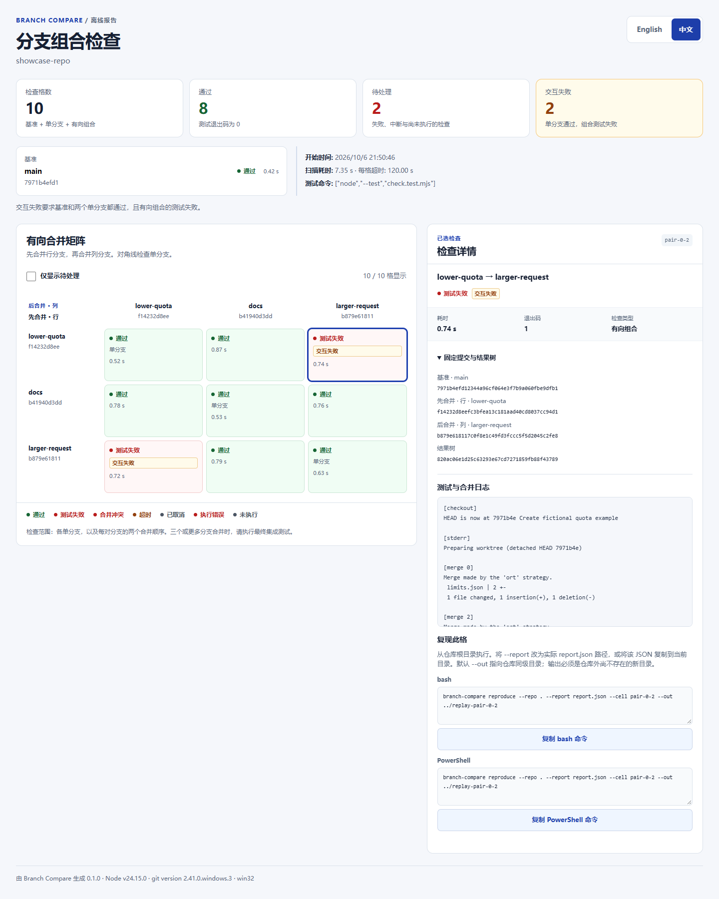

# Branch Compare

定位单独测试通过、合并后测试失败的 Git 分支。Branch Compare 在临时工作树中依次检查基准、每个候选分支和每对分支的两个合并顺序，生成可离线查看、切换中英文的比较报告。

[简体中文](README_ZH.md) · [English](README.md) · [快速开始](#快速开始) · [检查自己的分支](#检查自己的分支) · [复现结果](#复现结果)



## 快速开始

需要 **Node.js 24 或更新版本**及 **Git**（已使用 Git 2.41 验证）。CLI 没有运行时 npm 依赖。

```sh
git clone https://github.com/cloudwallker/branch-compare.git
cd branch-compare
npm ci
npm run build
```

创建包含三个分支的虚构仓库，再运行测试：

```sh
node examples/create-demo.mjs ./demo-repo
node dist/cli.js run --repo ./demo-repo --base main --ref lower-quota --ref docs --ref larger-request --out ./demo-report -- node --test check.test.mjs
```

用浏览器打开 `demo-report/report.html`。报告共 **10 格**，其中 **2 格交互失败**：`lower-quota` 与 `larger-request` 在两个合并顺序下都会失败。各分支单独通过；组合后的请求数量为 50，超过了 20 的配额。扫描退出码为 **1**，符合演示预期。

`demo-repo`、`demo-report` 及下文的复现目录都必须是尚不存在的新目录。此处报告位于被扫描的 `demo-repo` Git 仓库之外。

## 检查自己的分支

在 Branch Compare 项目目录中执行：

```sh
node dist/cli.js run --repo ../my-project --base main --ref feature-a --ref feature-b --out ../branch-report -- node --test
```

`--` 后的程序直接启动，各参数按字面传入。需要先安装依赖再测试等 shell 操作时，使用 `--test`：

```sh
node dist/cli.js run --repo ../my-project --base main --ref feature-a --ref feature-b --out ../branch-report --test 'npm ci && npm test'
```

这种写法也适用于 Windows 的 `npm.cmd` 等批处理入口。Unix 使用 `/bin/sh`；Windows 使用 `cmd.exe` 或 `ComSpec` 指定的 shell。测试命令应在前台运行，并在测试结束时退出。

| 参数 | 含义 |
| --- | --- |
| `--repo PATH` | 本地 Git 工作树，默认为 `.`。 |
| `--base REF` | 基准分支、标签或提交。 |
| `--ref REF` | 候选 ref，重复指定 2–5 次；每个候选提交必须包含基准提交，且解析为不同提交。 |
| `--out PATH` | 仓库及其 Git 元数据目录之外，尚不存在的新输出目录。 |
| `--test COMMAND` | shell 命令；与 `--` 后的程序二选一。 |
| `--timeout SECS` | 每格测试超时，范围 1–3600 秒，默认 120 秒。 |
| `--locale en\|zh` | 报告初始语言，默认为 `en`。 |

运行 `node dist/cli.js --help` 查看完整命令。构建后在项目目录执行一次 `npm link`，即可在其他目录使用 `branch-compare` 命令。

## 读懂矩阵

对于 `n` 个候选 ref，扫描包含 `1 + n + n × (n − 1)` 格：一个基准、`n` 个单分支，以及每对分支的两个合并顺序。两个候选共 5 格，五个候选共 26 格。

每格从固定的基准提交开始。单分支格合并一个候选；组合格**先合并行分支，再合并列分支**。对角线显示单分支结果，基准通过独立卡片展示。

只有基准及对应的两个单分支都通过、组合格的测试命令失败时，该格才标记为**交互失败**。合并冲突、超时和执行错误分别保留各自状态。两两检查说明两个分支之间的交互；三个或更多分支共同合并时，需运行最终集成测试。

选择任意格可查看合并和测试日志、冲突路径、耗时、测试退出码、输入提交 SHA 和结果 Git 树 SHA。报告还提供失败筛选、键盘操作、语言切换与所选格的复现命令。

## 复现结果

复现演示中的 `lower-quota → larger-request` 格：

```sh
node dist/cli.js reproduce --repo ./demo-repo --report ./demo-report/report.json --cell pair-0-2 --out ./demo-replay
```

复现采用报告中记录的提交 SHA 和合并顺序，分支名称随后移动也不会改变输入。源仓库需要仍然保留这些提交。若报告记录了结果树 SHA，复现会检查合并树是否一致。这个演示的复现退出码同样为 1。

HTML 报告复制出的命令使用 `branch-compare reproduce --repo .`。请从**源仓库根目录**执行，将 `--report` 改为实际的 `report.json` 路径，或将该 JSON 复制到当前目录，并使用新的输出目录。默认 `--out ../replay-CELL_ID` 指向源仓库的同级目录。可以用 `npm link` 配置命令，也可将 `branch-compare` 替换为 `node /path/to/branch-compare/dist/cli.js`。

若报告标记原测试命令已脱敏，请通过 `--test` 或 `--` 补充替代命令。复现时也可覆盖 `--timeout` 和 `--locale`。

## 执行方式与报告文件

Git 操作在开始时固定所有 ref，创建独立的临时本地克隆，再按顺序为每格创建 detached 工作树。源仓库的 hooks 和本地配置不参与执行，合并采用 Git 默认行为。扫描检查已提交的历史，因此需先提交要比较的代码和测试文件。

**使用你信任的测试命令。** 临时克隆隔离 Git 工作；测试命令具有用户正常的文件系统和网络权限。发生超时或取消时，Branch Compare 先终止启动的进程树，再清理临时资源。若无法确认进程终止或资源归属，会保留相关临时资源并记录清理错误。

报告成功写入后包含：

```text
branch-report/
├── report.html       # 自包含的离线报告
├── report.json       # 结构化结果与固定提交 SHA
└── logs/
    ├── base.txt
    ├── single-0.txt
    └── pair-0-1.txt   # 每个计划格各有一份日志
```

HTML 内嵌样式和脚本，无需加载外部资源。每格日志上限为 **256 KiB**，先展示 stdout，再展示 stderr。冲突列表最多显示 1,000 个路径；省略的路径会在日志中明确标记。命令与日志会处理已知凭据格式、环境变量中的秘密值及绝对路径；发布或分享前，请检查生成文件。

| 退出码 | 结果 |
| --- | --- |
| `0` | 检查通过。 |
| `1` | 测试失败、合并冲突或超时。 |
| `2` | 输入错误、基础设施错误或清理错误。 |
| `130` | 扫描已取消。 |

## 开发与验证

```sh
npm ci
npm test
npm run typecheck
npm run build
npx playwright install --with-deps chromium
npm run test:e2e
```

GitHub Actions 在 Ubuntu 和 Windows 上使用 Node.js 24 执行单元及集成测试、类型检查和构建。独立的 Ubuntu 任务执行浏览器检查，覆盖离线行为、中英文交互、不可信文本、命令复制，以及 375、768、1440 像素宽度的布局。

## 项目背景与许可

Branch Compare 是独立设计和实现的分支交互测试工具。工作流程探索参考了 [Orca 的并行工作树](https://github.com/stablyai/orca)与 [agent-worktree 的隔离式代理工作流程](https://github.com/nekocode/agent-worktree)。

[MIT 许可证](LICENSE) · Copyright © 2026 cloudwallker。
